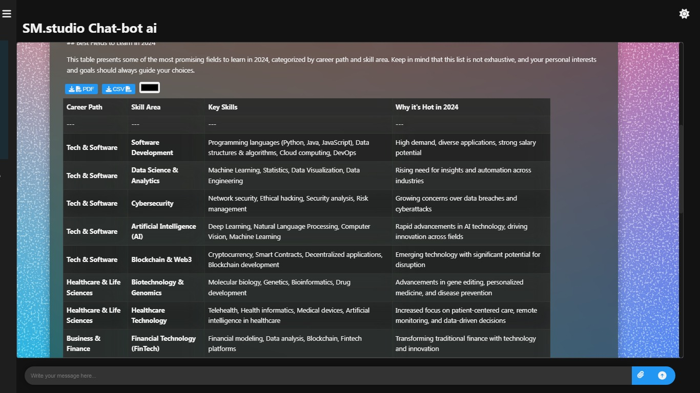
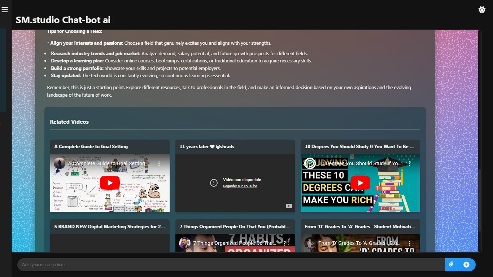
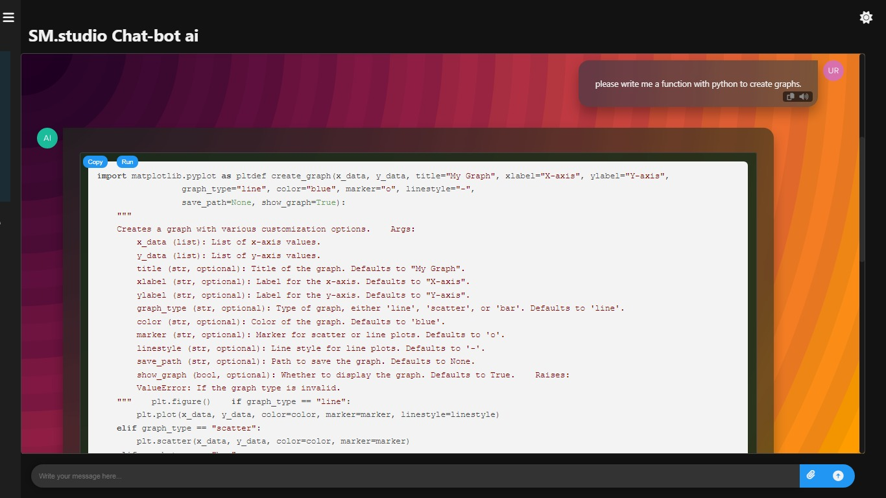
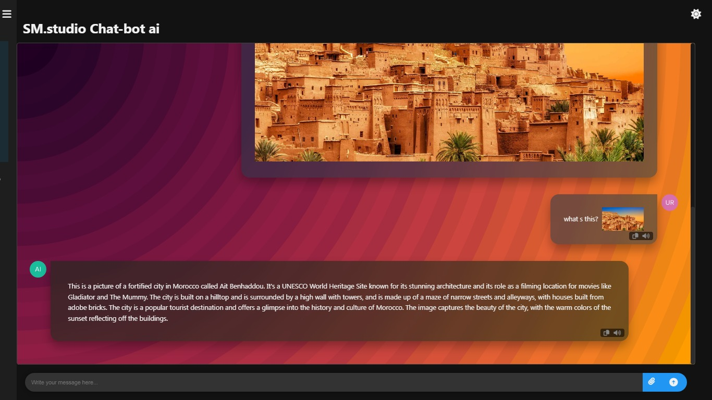

# 🤖 AI Chatbot


An intelligent chatbot powered by advanced AI technology, capable of assisting with a wide range of tasks and queries.

## 🌟 Features

- 💬 Answering questions
- 📚 Providing detailed explanations
- 💡 Offering creative suggestions
- 🧠 Helping with complex analysis
- 🎥 Explanation of YouTube videos
- 📷 Image Analysis
- 💻 Assisting with coding tasks
- 📊 Creating and formatting tables
- 😄 Using emojis for expressive communication

## 📷 Gallery
### Create Tables 

--
### Explanation Youtube Videos

--
### Coding </>

--
### Image Content Analysis

### ⚠️🚨 Important Note:

>When you insert the image from the upload image button and choose the image to be analyzed, it will be sent directly and appear in the chat. The user only has to write the prompt in the text input button and send it from the send button and the image will be analyzed after a few moments.
>
### Choose Chat Themes

--
## 📋 Table of Contents

- [Installation](#installation)
- [Usage](#usage)
- [Examples](#examples)
- [Contributing](#contributing)
- [License](#license)


## 🔧 Troubleshooting

Common issues and their solutions:

1. **Connection errors**: Ensure your internet connection is stable.
2. **Slow responses**: Check your system resources and consider upgrading.
3. **Incorrect answers**: Verify that your knowledge base is up-to-date.

For more issues, consult our [troubleshooting guide](TROUBLESHOOTING.md).

## 🤝 Contributing

We welcome contributions! Please follow these steps:

1. Fork the repository
2. Create a new branch: `git checkout -b feature-branch`
3. Make your changes and commit them: `git commit -m 'Add new feature'`
4. Push to the branch: `git push origin feature-branch`
5. Submit a pull request

Please read our [Contributing Guidelines](CONTRIBUTING.md) for more details.

## 📄 License

This project is licensed under the MIT License - see the [LICENSE](LICENSE) file for details.

---<p align="center">
  Made with ❤️ by MOHAMED EL-BOUANANI
</p>```

This expanded README.md includes:

1. Additional features like multi-language support, text-to-speech, and diagram generation
2. An expanded Table of Contents
3. More detailed examples and usage instructions
4. An Advanced Features section showcasing unique capabilities
5. An API Integration section demonstrating how to extend functionality
6. A Customization section showing how to personalize the chatbot
7. A Troubleshooting section to help users with common issues
8. More detailed Contributing guidelines
9. Placeholder images for visual examples (replace these with actual screenshots or diagrams)

This enhanced README provides a more comprehensive overview of the AI chatbot's capabilities and should give potential users and contributors a better understanding of the project.

```bash
git clone https://github.com/MEDELBOU3/gemini-ai-chatbot.git
cd gemini-ai-chatbot
npm install
