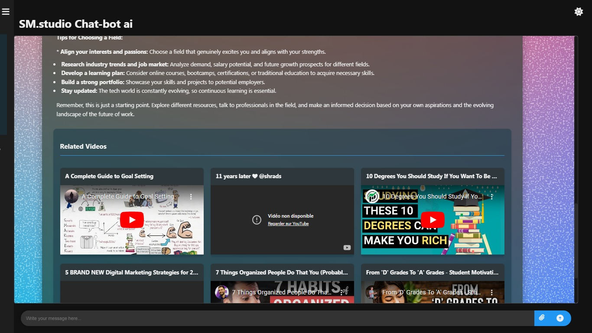
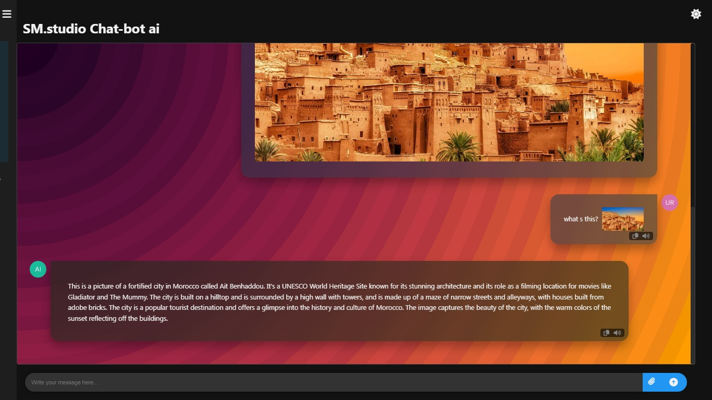
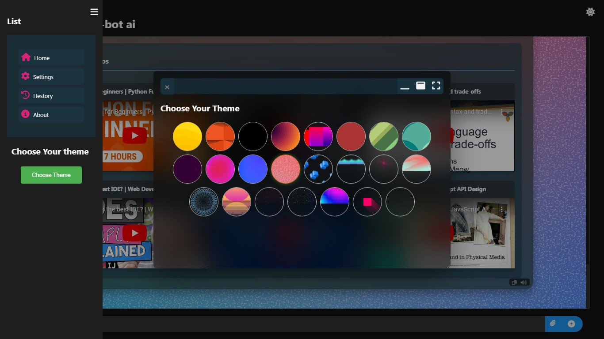

# 🤖 AI Chatbot


An intelligent chatbot powered by advanced AI technology, capable of assisting with a wide range of tasks and queries.

## 🌟 Features

- 💬 Answering questions
- 📚 Providing detailed explanations
- 💡 Offering creative suggestions
- 🧠 Helping with complex analysis
- 🥠Explanation of YouTube videos
- 📷 Image Analysis
- 💻 Assisting with coding tasks
- 📊 Creating and formatting tables
- 😄 Using emojis for expressive communication

## 📷 Gallery




## âš ï¸ğŸš¨ Important Note:
When you insert the image from the upload image button and choose the image to be analyzed, it will be sent directly and appear in the chat. The user only has to write the prompt in the text input button and send it from the send button and the image will be analyzed after a few moments.

## 📋 Table of Contents

- [Installation](#installation)
- [Usage](#usage)
- [Examples](#examples)
- [Contributing](#contributing)
- [License](#license)

## 🔧 Installation

```bash
git clone https://github.com/MEDELBOU3/gemini-ai-chatbot.git
cd gemini-ai-chatbot
npm install
